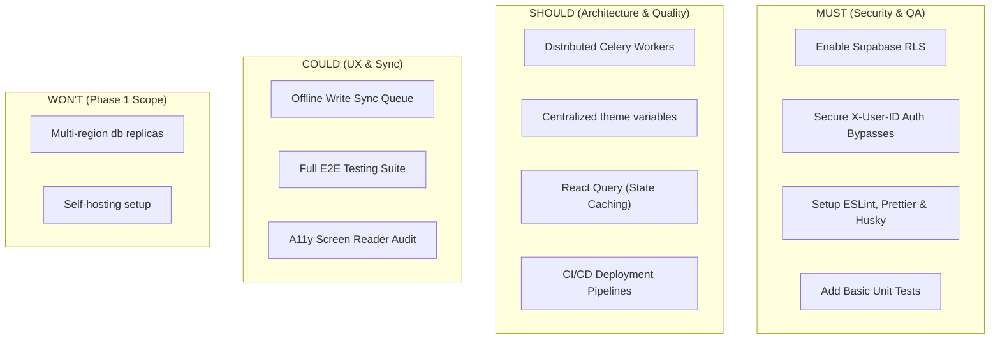

# Lucid Project: Enterprise Production Readiness Assessment

This document serves as a comprehensive analysis of the current development level of the **Lucid Learning Platform** (encompassing the Expo React Native `Lucid_Mobile` app and the FastAPI `Lucid_Prototype/Backend`). It evaluates the application's current readiness for live release and identifies the critical security, architectural, and operational improvements required to achieve an enterprise-grade standard.

---

## Executive Summary

| Category | Status | Current Level | Primary Action Item |
| :--- | :--- | :--- | :--- |
| **Security & Privacy** | 🔴 Critical Gaps | MVP / Prototype | Enable Row-Level Security (RLS) on Supabase and remove API Auth fallbacks. |
| **Performance & Caching** | 🟢 Good | Early Production | Optimize cache-invalidation triggers for Redis & local storage. |
| **Scalability & Architecture** | 🟡 Moderate Gaps | Late Prototype | Delegate heavy AI/YOLO/media processing to asynchronous Celery/Redis workers. |
| **UI/UX Design Quality** | 🟡 High-Fidelity | Release Candidate | Centralize hardcoded design tokens and implement accessibility (A11y). |
| **DevOps & QA Testing** | 🔴 Critical Gaps | Initial Prototype | Setup automated CI/CD pipelines, ESLint/Prettier, and unit test suites. |

Currently, the Lucid project functions as a **High-Fidelity Feature-Complete Prototype**. It possesses a mature, async FastAPI backend, rich offline-caching strategies on the frontend, and highly interactive UI components (like the custom quiz grading system). However, it cannot be considered "Enterprise Ready" due to **critical database access exposure, API auth spoofing pathways, and a lack of automated test coverage**.

---

## 1. Is the App Enterprise Ready? (Current Readiness Level)

The app is currently **not enterprise-ready**. While the functional implementation of features (sprints, content library, interactive quizzes, video player, voice transcriptions, and AI roleplay scenarios) is advanced and highly stable, the infrastructure, security posture, and quality assurance processes reflect a prototype environment.

### Readiness Gap Analysis

```mermaid
radar-chart
    title "Lucid Enterprise Readiness Index (Scale 0-5)"
    axes
        "Data Security" : 1.0
        "API Authorization" : 1.5
        "Scalability & Workers" : 2.5
        "Performance & Caching" : 4.0
        "UI/UX Polish" : 3.8
        "Quality Assurance (Testing)" : 0.5
        "DevOps & CI/CD" : 1.0
```

*   **Security (1.0/5.0):** Severe vulnerabilities are present, primarily the lack of active Row Level Security (RLS) on the Supabase database layers and bypassable backend auth guards.
*   **Performance (4.0/5.0):** Very good. The use of Redis to cache complex database operations (e.g., learning plans, dashboards) and AsyncStorage for immediate offline feedback on the mobile device represents solid performance practice.
*   **Scalability (2.5/5.0):** The API is built asynchronously, which helps handle network concurrency. However, cpu-bound AI background processing (e.g., YOLOv8 models, video analysis, transcriptions) runs in-process, which will block and crash servers under high production load.
*   **UI/UX (3.8/5.0):** High visual quality. Smooth animations, custom indicators, and custom overlays are present. Gaps exist in accessibility, support for varying screen dimensions (tablets vs. small phones), and hardcoded styling tokens.
*   **Quality Assurance & Testing (0.5/5.0):** Critical gap. There are no automated unit tests, integration tests, or UI automation suites present in the codebase.
*   **DevOps (1.0/5.0):** Manual deployments. No automated pipelines (e.g., GitHub Actions, EAS Build workflows) or automated vulnerability scanners are configured.

---

## 2. What Parameters Define "Enterprise-Grade"?

An enterprise-grade application goes beyond functional correctness. It must assure corporate clients that their data is secure, the service is reliable, and the code is maintainable. The following parameters define this threshold for Lucid:

1.  **Data Isolation & Multi-Tenancy:** Proper logical isolation between corporate clients (tenants) so that company A can never see or modify the data of company B.
2.  **Zero-Trust API Security:** Every endpoint must authenticate and authorize requests cryptographically (e.g., using verified Firebase JWT signatures). No fallback parameters should allow spoofing identifiers via headers like `X-User-ID`.
3.  **Database Row Level Security (RLS):** Policies must be active at the database level to ensure that even if an API key is compromised, data cannot be modified or read outside of the user's tenant context.
4.  **Distributed Task Offloading:** Heavy media workloads (video parsing, YOLO object detection, audio transcribing) must be processed asynchronously using a queue/worker architecture (e.g., Celery, RQ, AWS Lambda) instead of blocking the main web server process.
5.  **Automated Continuous Integration (CI/CD):** Code must pass linting (ESLint), formatting (Prettier), static typing verification (TypeScript compiler), and regression tests before deployment.
6.  **Observability & Error Tracking:** Real-time logging, metrics, and error tracking (e.g., Sentry, Datadog) to alert developers to exceptions before users encounter them.
7.  **Service Level Agreements (SLA) & High Availability:** Multi-zone deployments, database replication, automatic failovers, and robust API rate-limiting.

---

## 3. Attributes to Check and Maintain (Operational Metrics)

To run a live, production-ready system, the following attributes must be continuously audited and monitored:

### Technical & System Metrics (APM)
*   **API Response Latency:** Maintain average response times `< 200ms` for cached endpoints, and `< 800ms` for dynamic DB queries.
*   **AI Inference Latency & Cost:** Track average duration of OpenAI and Gemini requests. Monitor API cost per user session.
*   **Database Connection Pools:** Monitor active PostgreSQL connection limits (especially important with serverless backends like Supabase).
*   **Redis Cache Hit Rate:** Maintain a hit rate `> 80%` on read-heavy routes to prevent database thrashing.
*   **Mobile Crash Rates:** Monitor session crash-free rates (`> 99.9%` target) using tools like Sentry or Firebase Crashlytics.
*   **Network Connectivity Resilience:** Verify that the mobile app gracefully handles offline states, retries API calls, and syncs local AsyncStorage state correctly when connection is re-established.

### Compliance & Administrative Attributes
*   **Data Retention & Deletion (GDPR/CCPA):** Maintain policies to purge user records and data when requested by a tenant admin.
*   **Encryption Keys & Rotation:** Ensure all SSL certificates, database secrets, and Firebase credentials are secure and rotated periodically.

---

## 4. Scalability Analysis

The current architecture is highly functional for low-to-medium user counts, but contains bottlenecks that will prevent large-scale concurrent operations:

### Scalability Strengths
1.  **FastAPI & Asyncio:** Built using asynchronous event-loop frameworks. It handles high I/O concurrency well.
2.  **Redis Caching Layer:** Read-heavy operations (e.g., learning plan retrieval, dashboard statistics, active sprints) are cached with TTLs, shielding the PostgreSQL database from repeated queries.
3.  **Local Caching (Mobile):** The mobile application writes progress updates immediately to local `AsyncStorage` and submits updates to the API in the background (as seen in [ModuleQuizScreen.tsx:L531-557](file:///d:/workfloww.ai/Lucid_Mobile/src/screens/home/ModuleQuizScreen.tsx#L531-L557)), delivering an instantaneous UI response regardless of network speed.

### Scalability Bottlenecks
1.  **In-Process AI Background Jobs:** In the current prototype, long-running processes (YOLOv8 image processing, LLM-based content generation, PDF extraction) run within the same FastAPI process or inside basic `BackgroundTasks` threads.
    *   *Risk:* Under high load, heavy CPU usage from yolov8 or PyMuPDF will saturate the CPU, causing API requests to time out, and potentially running out of memory (OOM crash).
    *   *Solution:* Transition to a distributed worker framework like **Celery** or **Arq** using Redis as a message broker.
2.  **Global React State Re-renders:** The mobile app relies heavily on nested React Context Providers (Tenant, ActiveSprint, Drawer, Auth).
    *   *Risk:* Any small change in context forces re-renders across all child components, causing lag on lower-end devices.
    *   *Solution:* Migrate large-scale state to **Zundstand** or **React Query** (TanStack Query) for optimized UI rendering and cached network queries.
3.  **Supabase Connection Saturation:** FastAPI route files make direct supabase queries on demand. As traffic increases, database connection exhaustion can occur.
    *   *Solution:* Ensure a connection pooler (like Supabase PgBouncer or Supabase Supavisor) is configured in production, or route requests through a connection pool library.

---

## 5. UI/UX Assessment

The application's interface is visually rich and implements micro-animations (e.g., pulsating gradients, grading loading states, and custom slide-out drawers), aligning well with modern mobile design principles.

### UI/UX Current Level: **Release Candidate (Visually High-Fidelity)**

```carousel
```python
# UI Element Strengths in ModuleQuizScreen.tsx
pulseCircleOuter: {
  width: 130, height: 130, borderRadius: 65,
  backgroundColor: "rgba(124, 58, 237, 0.15)",
  alignItems: "center", justifyContent: "center",
}
```
<!-- slide -->
```python
# ScreenRecordingGuard.tsx Overlay Security
overlay: {
  ...StyleSheet.absoluteFillObject,
  backgroundColor: "#0F172A",
  zIndex: 9999,
  justifyContent: "center", alignItems: "center",
}
```
````

### UI/UX Improvement Areas (Enterprise Requirements)
1.  **Lack of Centralized Design System:**
    *   Colors and styles are hardcoded inside individual screens (e.g., `#4F46E5`, `#1E1B4B`, `#10B981` scattered inside `ModuleQuizScreen.tsx` and `StudioScreen.tsx`).
    *   *Remediation:* Centralize all style constants (colors, margins, font sizes) into a unified `theme.ts` file and utilize React Native styling contexts to support Dark Mode and dynamic resizing.
2.  **Responsive Layout Adaptability:**
    *   The app uses hardcoded pixel layouts (e.g. `width: 130`, `paddingVertical: 14`). This can lead to visual bugs on small-screen phones or oversized, empty spaces on tablets.
    *   *Remediation:* Test layouts on multiple simulator screen sizes. Use flexbox grids and percentage layouts to ensure adaptability.
3.  **Accessibility (A11y):**
    *   Components lack accessibility labels (`accessibilityLabel`), meaning users relying on screen readers cannot easily navigate.
    *   *Remediation:* Inject `accessible={true}` and description tags to all primary buttons and interactable cards.

---

## 6. Security Vulnerability Audit

This section highlights the critical security gaps identified during the codebase audit and provides actionable remediation pathways.

### Vulnerability 1: Supabase Row-Level Security (RLS) Disabled [CRITICAL]
*   **Location:** 60 Tables in `public` schema of Supabase database (including `users`, `assessments`, `employee_assessments`, `training_modules`, `roles`).
*   **Impact:** RLS is disabled. Under Supabase architecture, any client possessing the client public anon key (`NEXT_PUBLIC_SUPABASE_ANON_KEY`) can query, update, or delete records from any table directly without API constraints. This allows a compromised client to dump the entire database or modify permissions.
*   **Remediation Action:** Enable RLS and define security policies based on authentication tokens.
    ```sql
    -- Example: Enable RLS on users table
    ALTER TABLE public.users ENABLE ROW LEVEL SECURITY;
    
    -- Create policy: Users can only read/write their own profile
    CREATE POLICY "Users can view own profile" 
    ON public.users 
    FOR SELECT 
    USING (auth.uid()::text = firebase_uid);
    ```

### Vulnerability 2: API Authentication Spoofing via `X-User-ID` Fallback [HIGH]
*   **Location:** [utils/auth.py:L219-272](file:///d:/workfloww.ai/Lucid_Prototype/Backend/utils/auth.py#L219-L272)
*   **Impact:** When the `Authorization` header is missing, the backend's optional authentication helper falls back to reading the `X-User-ID` request header. This is acceptable for local testing, but in production, an attacker can modify this header to masquerade as any user in the system without presenting a valid password or Firebase token.
*   **Remediation Action:** Disable `X-User-ID` parsing for all environments except local development (`__DEV__`).
    ```python
    # Secure implementation in utils/auth.py
    if x_user_id and os.getenv("ENV_STAGE") == "local":
        # Allow fallback only in local debug environments
        resolved = _resolve_firebase_uid_to_user_id(x_user_id)
        return RequestAuth(user_id=resolved, email=None, source="legacy-x-user-id", claims=None)
    ```

### Vulnerability 3: Public Environment Credentials exposed in Mobile App [MEDIUM]
*   **Location:** [Lucid_Mobile/.env](file:///d:/workfloww.ai/Lucid_Mobile/.env)
*   **Impact:** Firebase credentials (`EXPO_PUBLIC_FIREBASE_API_KEY`, etc.) are bundled directly into the JavaScript client bundle. While client configuration is public by design, leaving them without strict API restriction rules on the Firebase Console allows attackers to use these keys to write scripts to interact with your authentication and Firestore resources, leading to potential billing spikes.
*   **Remediation Action:** Enforce domain/app restrictions on API keys inside the Google Cloud Console / Firebase Console.

### Vulnerability 4: In-Memory Scheduler Non-Resilience [LOW/MEDIUM]
*   **Location:** [Backend/scheduler.py](file:///d:/workfloww.ai/Lucid_Prototype/Backend/scheduler.py)
*   **Impact:** The background scheduler uses `MemoryJobStore`. Although actual email and WhatsApp jobs are persisted in Supabase tables, the cron task that reads and dispatches them relies on this local, in-memory scheduler instance. If the server crashes or restarts, active polling schedules are interrupted.
*   **Remediation Action:** Migrate the background scheduler to a persistent Redis-backed store (e.g. `RedisJobStore` or Celery Beat).

---

## 7. MoSCoW Prioritization Matrix

To guide the transition from feature prototype to live launch, the required updates have been structured using the MoSCoW method.



### Must Have (Immediate Actions)
1.  **Enable Supabase RLS** on all 60 public tables and configure policies.
2.  **Restrict `X-User-ID` Header Auth Fallback** to development environments only.
3.  **Implement Code Quality Tooling:** Install and configure ESLint, Prettier, and pre-commit hooks (Husky) to ensure code standard consistency.
4.  **Write Initial Test Suites:** Establish basic unit tests for auth context utilities, database operations, and user route controllers using Jest (for mobile) and PyTest (for backend).
5.  **Configure Sentry Error Reporting** on backend API and React Native app to capture production exceptions.

### Should Have (Next Actions)
1.  **Offload Heavy Tasks to Celery:** Decouple FastAPI from video analysis (OpenCV/YOLOv8) and transcriptions.
2.  **Centralize App Theme System:** Extract inline color hashes and layout constants to a global design provider.
3.  **Adopt React Query:** Re-write mobile API fetches to utilize `react-query` to simplify loading/error handling, automatic retry mechanisms, and cache invalidation.
4.  **Automated CI/CD Pipelines:** Implement GitHub Actions to build mobile staging bundles (via Expo EAS) and deploy FastAPI code to staging automatically.

### Could Have (Future Polish)
1.  **Offline Write-Back Queue:** Implement a queue to record user quiz/sprint attempts offline and sync them back to the server once internet connection is restored.
2.  **Accessibility Overhaul:** Ensure all text passes color-contrast benchmarks and interactive items are compatible with iOS VoiceOver and Android TalkBack.
3.  **Complete Integration Testing:** Aim for `> 80%` code coverage with automated unit and integration test runs in the CI suite.

### Won't Have (Deferred)
1.  **Multi-Region Database Replication:** Defer active-active multi-region clustering until global user scaling warrants the cost.
2.  **Self-Hosting Infrastructure:** Rely on Supabase managed cloud hosting and Firebase services; self-hosting configurations are out of scope for the current launch.

---

## 8. Production Readiness Checklist (Go-Live Guide)

The following checklist must be systematically completed and approved by the engineering lead prior to production deployment:

### 🟩 Security & Database Sign-Off
- [ ] Row-Level Security (RLS) enabled on all 60 database tables.
- [ ] Row access policies verified: Users can only see their own progress, team members, and content matching their tenant company.
- [ ] Public anon-key access restricted inside Supabase dashboard settings.
- [ ] `X-User-ID` fallback disabled for production builds in `utils/auth.py`.
- [ ] Database backup schedule configured (e.g., daily automated snapshots).
- [ ] SSL connections forced for database, Redis cache, and public APIs.

### 🟩 API & Architecture Sign-Off
- [ ] API rate-limiting rules enabled (using Redis) to protect endpoints from DDoS or brute-force requests.
- [ ] Environment variables configured correctly (production database credentials, production Firebase account certificates).
- [ ] Long-running background jobs isolated to workers (or load-tested to prove in-process execution does not impact REST API latency).
- [ ] CORS policies narrowed to production domain (`https://lucid.workfloww.ai`) and development localhost strings removed.

### 🟩 Mobile App & UI/UX Sign-Off
- [ ] Production API endpoints set in production build environments (`EXPO_PUBLIC_API_URL` pointing to live servers).
- [ ] Screen recording protection verified on iOS (ScreenRecordingGuard) and Android (FLAG_SECURE) simulators.
- [ ] Firebase Cloud Messaging (FCM) credentials validated for production App Store/Google Play deployment.
- [ ] Mobile app bundle analyzed for size and unused node modules pruned.
- [ ] Staging test runs completed on physical iOS and Android devices.

### 🟩 DevOps & QA Sign-Off
- [ ] CI pipeline configured: Every pull request automatically runs linter checks and unit tests.
- [ ] Production health check routes (`/health`) verified and connected to an external status monitor (e.g., UptimeRobot).
- [ ] Logging sinks configured to export FastAPI exceptions to an active developer alerting system (e.g., Sentry, BetterStack).
